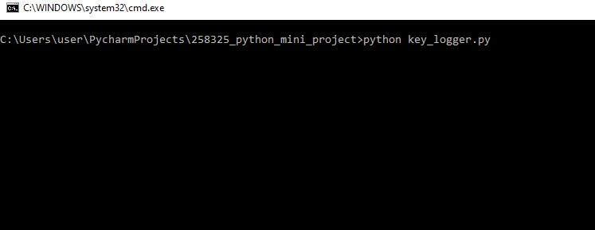
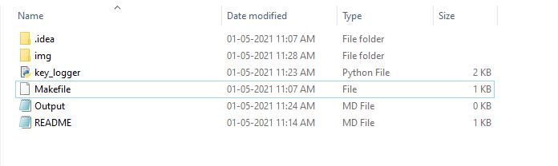
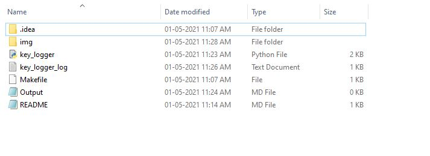
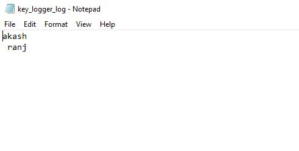

# Images of running project

## RUN

#### Files before running of python file

#### After running the python file a file is created `key_logger_log`

#### Keystrokes saved in `key_logger_log.txt` file

